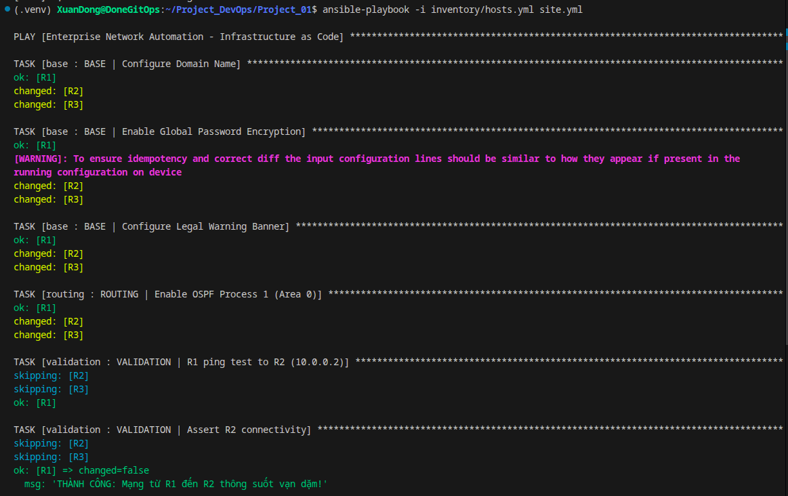
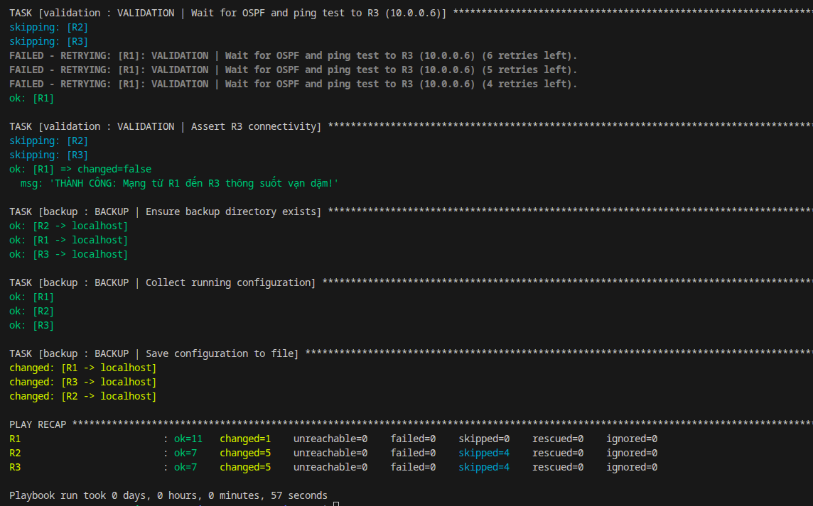

# Enterprise Network Automation: Infrastructure as Code (IaC)

> This project automates the management and configuration of a Cisco IOS enterprise-standard network using the Ansible Roles architecture on a GNS3 simulator.


---

## 📐 Network Topology

*(Insert your GNS3 topology image here. Example: ``)*

The network model is implemented using a daisy-chain structure with the following IP parameters:

| Device | Interface      | IP Address    | Function                     |
|--------|----------------|---------------|------------------------------|
| R1     | Fa0/0 (Cloud)  | 172.17.0.11   | Gateway connecting to Host   |
| R1     | Fa1/0          | 10.0.0.1      | P2P connection to R2         |
| R2     | Fa1/0          | 10.0.0.2      | P2P connection to R1         |
| R2     | Fa0/0          | 10.0.0.5      | P2P connection to R3         |
| R3     | Fa0/0          | 10.0.0.6      | P2P connection to R2         |

**Routing Note:** The Ansible Control Node only has direct connectivity to **R1** (`172.17.0.11`). Controlling R2 and R3 is achieved via Static Routing through R1.

---

## ✨ Features

The project is fully structured using the **Ansible Roles** model, breaking down tasks for easy management, scalability, and reusability:

* **`role/base`:** Automates baseline configuration (Domain name, global password encryption, Warning Banner).
* **`role/routing`:** Deploys dynamic routing via OSPF Area 0 across the entire network.
* **`role/validation`:** Implements Operational State Validation. The system automatically performs `ping` tests to verify connectivity, utilizing `until/retries` logic to wait for OSPF convergence and prevent false alarms.
* **`role/backup`:** Automatically collects `running-config`, categorizes them into specific Router directories, and saves files with Timestamps for version control.
* **Security:** The `hosts.yml` file containing real passwords is excluded via `.gitignore`, providing only a `.example` template for safe source code sharing.
* **CI/CD Pipeline:** Integrates GitHub Actions to automatically perform Syntax Checks whenever new code is pushed to the `main` branch.

---

## 🛠️ Tech Stack

| Layer            | Tool                        |
|------------------|-----------------------------|
| Control Node OS  | Ubuntu 24.04 LTS            |
| Network Emulator | GNS3 (Cisco c7200 IOS)      |
| Automation       | Ansible + ansible-pylibssh  |
| Version Control  | Git + GitHub Actions CI     |

---

## 🚀 Quick Start

**Prerequisites:** GNS3 must be running, Routers need bootstrap IP configuration and open SSH ports. The Control Node (Ubuntu) must be routed to ping R1.

```bash
# 1. Clone the repository
git clone [https://github.com/hoangdonguit/enterprise-network-automation.git](https://github.com/hoangdonguit/enterprise-network-automation.git)
cd enterprise-network-automation

# 2. Initialize the Inventory
mkdir -p inventory
cp inventory/hosts.yml.example inventory/hosts.yml
# Edit the hosts.yml file — Replace YOUR_PASSWORD_HERE with the actual password

# 3. Execute the Playbook
ansible-playbook -i inventory/hosts.yml site.yml
```

---

## 🎯 Proof of Work



---

## 🧩 Challenges & Solutions

### 1. SSH Cipher Algorithm Conflict (Legacy IOS vs Modern OpenSSH)
* **Issue:** Ubuntu 24.04 uses OpenSSH 9.x which deprecates legacy ciphers, whereas the Cisco c7200 virtual routers on GNS3 only support older algorithms.
* **Solution:** Overrode the security configuration directly in the project's `ansible.cfg` using `KexAlgorithms=+diffie-hellman-group1-sha1` and `Ciphers=+aes128-cbc,3des-cbc`.

### 2. False Alarms Before OSPF Convergence
* **Issue:** In the `validation` role, Ansible executed the `ping` command too quickly after configuring OSPF, leading to network unreachable errors because OSPF takes 10-20 seconds to populate the routing table.
* **Solution:** Implemented the `until` loop, allowing Ansible to retry tasks with a specific `delay` until OSPF successfully converges.